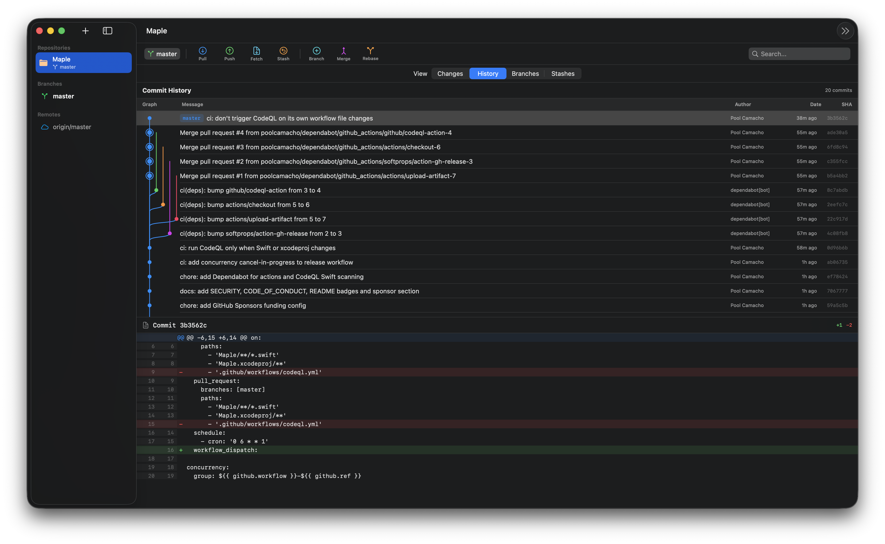
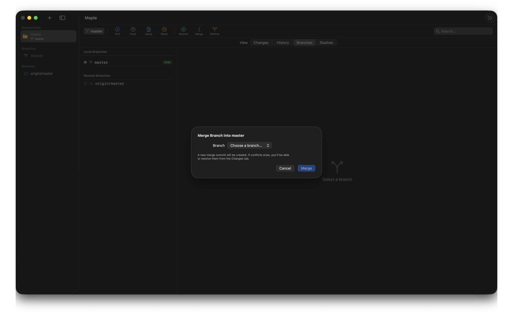
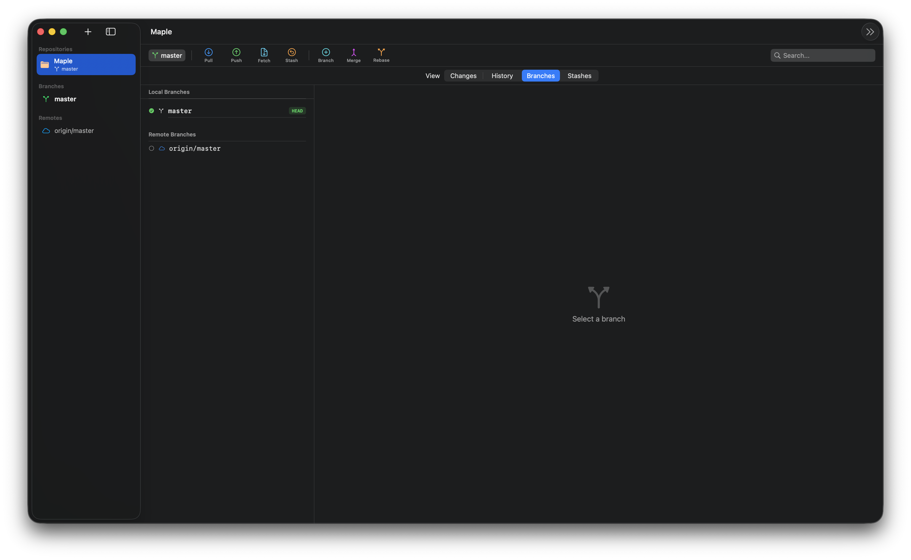

<div align="center">

# Maple

[](https://github.com/poolcamacho/Maple/actions/workflows/ci.yml)
[](https://www.apple.com/macos/)
[](https://swift.org)
[](LICENSE)
[](https://github.com/poolcamacho/Maple/stargazers)
[](https://github.com/poolcamacho/Maple/network/members)
[](https://github.com/poolcamacho/Maple/issues)
[](https://github.com/poolcamacho/Maple/commits/master)
[](https://github.com/sponsors/poolcamacho)

A **free, fast, native** macOS Git client built with SwiftUI. Inspired by [GitExtensions](https://gitextensions.github.io/), designed to feel at home on macOS.



</div>

## Why Maple

Most Git GUIs on macOS are Electron based, locked behind a subscription, or oversimplified to the point of hiding what Git actually does. Maple is none of those. It shells out to the `git` binary you already have, shows the full topology of your history, and stays out of the way when you know what you are doing.

## Features

- **Real commit graph.** Lane assignment, curved edges per parent, merge nodes rendered as a ring so joins stay legible across busy histories.
- **Interactive staging.** Tick a checkbox on any hunk header — or any individual `+` / `-` line — and stage only what you want. `Cmd+S` stages (or unstages) the current selection. Works in reverse too: view the staged diff and surgically peel changes back into the working tree.
- **Diff viewer with Blame toggle.** Syntax coloured hunks, line numbers, and per line author / hash / date when Blame is on.
- **Merge and rebase with conflict UX.** Detects `UU`, `AA`, `DD` automatically, shows an operation banner with Abort / Continue / Skip, and lets you resolve per file with Use Ours or Use Theirs.
- **Branch management.** Local and remote branches, checkout (including remote to local tracking), create, rename, delete.
- **Stash support.** Save, pop, apply, drop with custom messages.
- **Auto refresh.** FSEvents watcher on `.git/` picks up changes made outside the app.
- **Adaptive layout.** The toolbar, sidebar, and panels collapse gracefully from a wide desktop down to a compact laptop window.

## Screenshots

### Merge conflict resolution



### Branch management



## Requirements

- macOS 14.0+ (Apple Silicon recommended, Intel supported)
- Xcode 16+
- Git installed (ships with Xcode Command Line Tools)

## Getting started

```bash
git clone https://github.com/poolcamacho/Maple.git
cd Maple
open Maple.xcodeproj
```

Build and run from Xcode with `Cmd+R`.

## Architecture

```
Models/     Pure Sendable data (AppState, GitModels, StashModels)
Services/   GitService (actor, runs git via Process),
            GitCoordinator (@MainActor, orchestration),
            command extensions, CommitGraphBuilder,
            ConflictParser, FileWatcher
Views/      One file per view, all async work through the coordinator
Utils/      FolderPicker, DateExtensions
```

## Roadmap

### Done

- [x] Direct integration with the `git` binary via `Process`, with hardened stdin and pipe cleanup
- [x] Live `git status`, `git log`, `git diff` parsing
- [x] Commit, push, pull, fetch
- [x] Branch create, checkout, delete, rename
- [x] Stash save, pop, apply, drop
- [x] Auto refresh via FSEvents
- [x] Responsive layout with adaptive breakpoints
- [x] Separated architecture (Models / Services / Views / Utils)
- [x] Blame view with per line author, hash, date
- [x] Commit graph with real branch topology
- [x] Merge and rebase with conflict resolution UI
- [x] Interactive staging — hunk level (select hunks with checkboxes, stage or unstage)
- [x] Interactive staging — line level (pick individual `+` / `-` lines within a hunk)
- [x] `Cmd+S` stages / unstages the current selection

### Next

- [ ] Tag management (create, list, delete)
- [ ] Search filtering (commits, files)
- [ ] Clone from URL
- [ ] Remote management (add, remove, configure)
- [ ] Keyboard shortcuts (`Cmd+Enter` commit, command palette)
- [ ] Persist open repositories between sessions
- [ ] Settings and preferences
- [ ] Signed and notarized releases

## Contributing

Contributions are welcome. See [CONTRIBUTING.md](CONTRIBUTING.md) for the workflow and [CODE_OF_CONDUCT.md](CODE_OF_CONDUCT.md) for community expectations. Security issues go through the private flow in [SECURITY.md](SECURITY.md).

## Sponsor

Maple is developed on nights and weekends. If it saves you time, consider [sponsoring on GitHub](https://github.com/sponsors/poolcamacho) so it stays free and actively maintained.

## License

[MIT](LICENSE)
